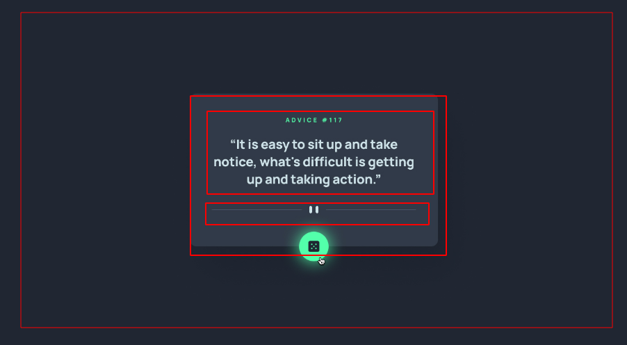

# Analize

- [] Tirar dúvidas

    - [] como o botão brilha

    - [x] Onde está a resolução 
    

    - [x] Qual o tamanho dos boxes 
          Conferir pelas imagens 

    - [] O elemento vai diminuir de tamanho como ?
        usando % ou vw e vh ?

- [x] Criação da concepção dos containers
        

- [x] componentização
        Não será preciso para uma única tela

# Construção das pastas

- [x] Baixar imagens do fontend mentor 

# Construção do html

- [] Organização das pastas
- [] Criar um repositório remoto
# Construção do css

# Criar o JS

## Publicar solução 

- [] Fazer gifs da sua funcionalidade
- [] Fazer prints das telas 
- [] Criar montagens com as telas printadas e elementos
- [] Talvez criar vídeos com processo de construção com música
- [] Publicar em um blog ou no yt falando sobre
- [] Desenvolver um texto para falar do processo.

- [] Submit your solution on the platform for the rest of the community to see. Follow our ["Complete guide to submitting solutions"](https://medium.com/frontend-mentor/a-complete-guide-to-submitting-solutions-on-frontend-mentor-ac6384162248) for tips on how to do this.

- [] Linkedin marcando a dev em dobro
- [] Grupos do facebook
- [] No grupo da rocket
- [] No twiter 
- [] No instagram